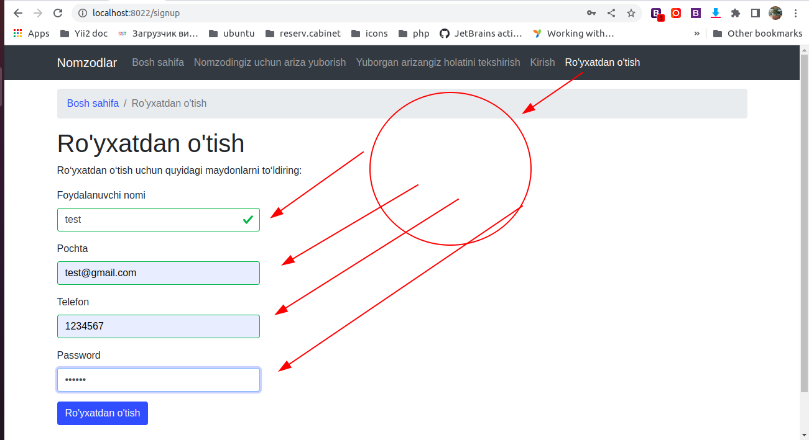
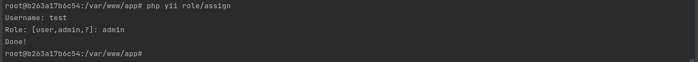
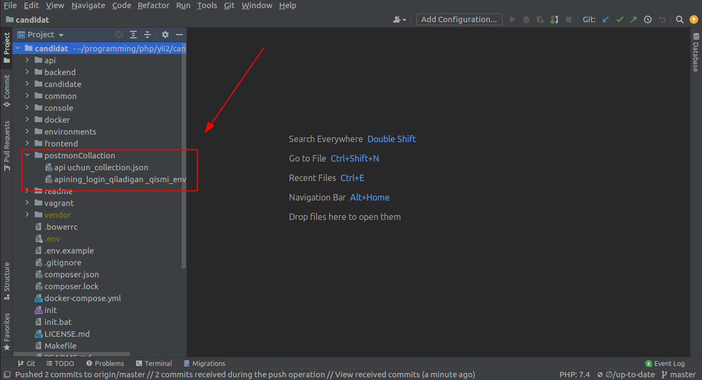

<p align="center">
    <h1 align="center">Assalomu alykum</h1>
    <a href="https://github.com/yiisoft" target="_blank">
        
    </a>
    <h1 align="center">Yii 2 Framework yordamida loyiha yaratildi</h1>
    <br>
    <b> Ubuntu 20.04.4 LTS </b>
    <br>
    <h3>Birinchi o'rinda <b>docker<b> va </b>docker-compose</b> ni o'rnatamiz</h3>
    <p>
        docker --version <br>
        Docker version 20.10.16
    </p>
<p>
    <p>
        1. sudo apt-get update
    
        2. sudo apt-get install \
            ca-certificates \
            curl \
            gnupg \
            lsb-release
        3. sudo mkdir -m 0755 -p /etc/apt/keyrings
    
        4. curl -fsSL https://download.docker.com/linux/ubuntu/gpg | sudo gpg --dearmor -o /etc/apt/keyrings/docker.gpg
    
        5. echo \
          "deb [arch=$(dpkg --print-architecture) signed-by=/etc/apt/keyrings/docker.gpg] https://download.docker.com/linux/ubuntu \
          $(lsb_release -cs) stable" | sudo tee /etc/apt/sources.list.d/docker.list > /dev/null
    
        6. sudo apt-get update
    
        7. sudo chmod a+r /etc/apt/keyrings/docker.gpg
    
        8. sudo apt-get update
    
        9. apt-cache madison docker-ce | awk '{ print $3 }'
        
        10. VERSION_STRING=5:20.10.16~3-0~ubuntu-focal
            sudo apt-get install docker-ce=$VERSION_STRING docker-ce-cli=$VERSION_STRING containerd.io docker-buildx-plugin docker-compose-plugin
    <p>
        docker-compose --version <br>
        docker-compose version 1.29.2
        
        sudo curl -SL https://github.com/docker/compose/releases/download/1.29.2/docker-compose-linux-x86_64 -o /usr/local/bin/docker-compose
        
        sudo ln -s /usr/local/bin/docker-compose /usr/bin/docker-compose
    </p>
    <p>
        git --version <br>
        git version 2.25.1
    </p>
    <p>
        git clone https://github.com/usmonkulov/candidat.git candidat <br>
        sudo cp .env.example .env <br>
    </p>    
    <br>
     <p>
        O'rnatish <br>
        sudo docker-compose build <br>
        Loyihani ko'tarish (Yoqish) <br>
        sudo docker-compose up -d <br>
        Loyihani yiqitish (O'chirish) <br>
        sudo docker-compose down <br>
    </p>    
    <p>
        Containerning ichiga kiramiz <br>
        sudo docker-compose ps (candidat_php-cli_1) <br>
        sudo docker exec -it candidat_php-cli_1 bash (container ichiga kirdik)<br>
        composer install <br>
        php init <br>
        [0] Development (Tanlaymiz) <br>
        yes (ni kiritamiz)
        php yii migrate <br>
        [yes] <br>
        php yii migrate <br>
        <a href="http://localhost:8022">localhost:8022 (Frontend) Urlga kiramiz va ro'yxatdan o'tamiz</a> <br>
        
    </p> <br>
    <p>
        <a href="http://localhost:8021">localhost:8021 (Backend)</a> <br> 
        <a href="http://localhost:8022">localhost:8022 (Frontend)</a> <br> 
        <a href="http://localhost:8023">localhost:8023 (Api)</a> <br> 
    </p>
    <p>
        php yii role/assign <br>
        Username: test (Ro'yxatdan o'tgan usernamengizni kiritasiz) <br>
        Role: [user,admin,?]: admin (Admin yoki User ni tanlaymiz) <br>
        Done! <br>
        exit <br>
        
        sudo chmod -R 777 api/runtime <br>
        <a href="http://localhost:8021">localhost:8021 (Endi adminkaga kirsak bo'ladi)</a> <br>
    </p>
    <p>
        <a href="http://localhost:8023">localhost:8023 (Api ni ishlatamiz birinchi quyidagi postmon collactionni import qilib oling)</a> <br>
         <br>
        Collections va Environments larni import qilib oling va o'zingiz ishlatib ko'ring <br>
        Savollar bo'lsa <a href="https://t.me/bobur_usmonkulov">@bobur_usmonkulov</a> menga bo'g'aning iloji boricha javob beraman <br>
        Kimgadir Projectingiz uchun foydasi tegsa xursandman Realni loyiha uchun qo'l keladi Dockerni yangi o'rganuvchilar uchun osongina ko'tariladi(php7.4 uchun)<br>
        Raxmat!
    </p>
</p>

Fayillar strukturasi
-------------------

```
common
    auth
    bootstrap
    config
    fixtures
    mail
    tests
    widgets
console
    config
    controllers
    migrations
    models
    runtime
backend
    assets
    bootstrap
    config
    controllers
    docker
    forms
    runtime
    tests
    views
    web
    widgets
frontend
    assets
    bootstrap
    config
    controllers
    docker
    runtime
    tests
    views
    web
api
    bootstrap
    config
    controllers
    docker
    helpers
    providers
    runtime
    tests
    web
candidate
    access
    behaviors
    dispatchers
    entities
    forms
    helpers
    jobs
    readModels
    repositories
    services
    status
    useCases
vendor/                  contains dependent 3rd-party packages
environments/            contains environment-based overrides
```

